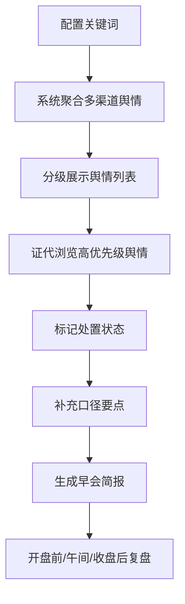

## 1. 产品概述

面向上市公司董秘办和证券事务代表的 Web 舆情盯盘台，聚焦于"把每天最该回应的舆情拎出来"，而非全网大屏展示。系统通过关键词聚合多渠道舆情信息，按优先级分层展示，并提供处置记录和早会简报功能，帮助证代高效完成每日三次快速复盘。

- 目标用户：上市公司董秘、证券事务代表
- 核心价值：提升舆情响应效率，降低信息噪音，聚焦高优先级舆情
- 使用场景：开盘前、午间、收盘后三次快速复盘

## 2. 核心功能

### 2.1 用户角色

| 角色 | 注册方式 | 核心权限 |
|------|----------|----------|
| 证代/董秘 | 内部账号 | 配置关键词、查看舆情、标记处置、生成简报 |

### 2.2 功能模块

1. **设置页**：公司关键词配置，包括公司简称、股票代码、核心产品、董监高姓名、常见误写词
2. **盯盘页**：舆情分级列表，按监管敏感、股价联动、投资者集中提问、普通讨论四层展示
3. **处置页**：处置记录管理，标记状态、补充口径要点、生成早会简报

### 2.3 页面详情

| 页面名称 | 模块名称 | 功能描述 |
|----------|----------|----------|
| 设置页 | 公司基本信息 | 公司简称、股票代码、所属行业配置 |
| 设置页 | 关键词管理 | 核心产品、董监高姓名、常见误写词的增删改查 |
| 设置页 | 数据源配置 | 新闻、股吧、社媒、问答平台的开关配置 |
| 盯盘页 | 分级导航栏 | 四个舆情等级的切换和数量统计 |
| 盯盘页 | 舆情卡片列表 | 每条舆情展示来源、发布时间、传播热度、建议关注原因 |
| 盯盘页 | 搜索与筛选 | 按关键词、来源、时间范围筛选舆情 |
| 盯盘页 | 热度趋势 | 当日舆情热度变化趋势图 |
| 处置页 | 处置列表 | 待处置、已处置舆情列表，支持状态筛选 |
| 处置页 | 处置操作 | 标记已回复/待核实/无需处理，补充口径要点 |
| 处置页 | 早会简报 | 生成开盘前、午间、收盘后三个时段的简报，支持复制导出 |
| 处置页 | 处置统计 | 当日处置数量、平均响应时间等统计指标 |

## 3. 核心流程

用户每日工作流程：开盘前打开盯盘页查看高优先级舆情 → 标记待处置项 → 处置页补充口径 → 生成早会简报 → 午间/收盘后重复复盘流程。

## 4. 用户界面设计

### 4.1 设计风格

- 设计定位：专业、沉稳、高效的金融工具风格
- 主色调：深蓝（#1a365d）作为主色，体现专业稳重
- 辅助色：警示红（#e53e3e）用于监管敏感，橙（#dd6b20）用于股价联动，蓝（#3182ce）用于投资者提问，灰（#718096）用于普通讨论
- 字体：标题使用思源宋体（体现专业感），正文使用 Inter/系统无衬线字体（保证可读性）
- 布局：左侧导航 + 右侧内容区的经典后台布局，卡片式信息展示
- 整体风格：信息密度适中，层次分明，强调数据可视化和状态标识

### 4.2 页面设计概述

| 页面名称 | 模块名称 | UI 元素 |
|----------|----------|---------|
| 设置页 | 关键词配置 | 分组表单、标签式关键词输入、保存按钮 |
| 盯盘页 | 分级导航 | 四色标签页、数字徽章、悬停动效 |
| 盯盘页 | 舆情卡片 | 来源图标、时间戳、热度进度条、关注原因标签 |
| 处置页 | 处置列表 | 状态标签、口径摘要、操作按钮组 |
| 处置页 | 早会简报 | 时段切换、分节内容、复制/导出按钮 |

### 4.3 响应式

- 桌面端优先设计，适配 1280px 及以上宽度
- 平板端侧边栏可收起，内容区自适应
- 移动端简化为底部导航，卡片单列展示

### 4.4 动效与交互

- 页面切换采用淡入淡出过渡
- 舆情卡片悬停时有轻微上浮和阴影加深效果
- 分级标签切换有平滑的指示条滑动动画
- 热度数据加载时有数值递增动画
- 处置状态变更有确认反馈动效
