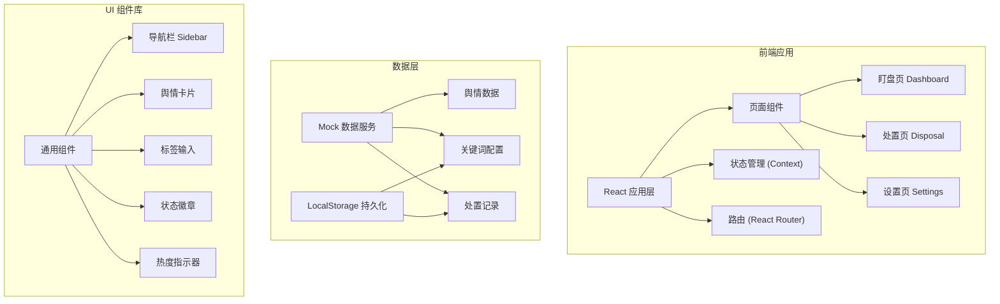
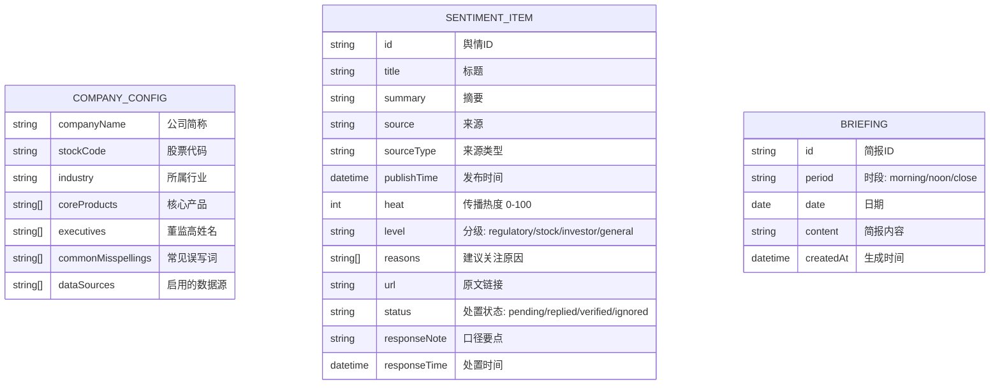

## 1. 架构设计

前端单页应用，使用 Mock 数据模拟后端服务，本地存储持久化用户配置和处置记录。



## 2. 技术描述

- **前端框架**: React 18 + TypeScript
- **构建工具**: Vite 5
- **样式方案**: TailwindCSS 3 + CSS Variables
- **路由管理**: React Router v6
- **状态管理**: React Context + useReducer
- **数据持久化**: LocalStorage
- **图表库**: Recharts（热度趋势图）
- **图标库**: Lucide React
- **Mock 数据**: 内置模拟舆情数据，无需后端

## 3. 路由定义

| 路由 | 页面 | 说明 |
|------|------|------|
| / | 盯盘页 | 舆情分级列表，默认首页 |
| /dashboard | 盯盘页 | 同首页，舆情分级展示 |
| /disposal | 处置页 | 处置记录管理和早会简报 |
| /settings | 设置页 | 公司关键词和数据源配置 |

## 4. 数据模型

### 4.1 数据模型定义



### 4.2 类型定义

```typescript
// 舆情分级
type SentimentLevel = 'regulatory' | 'stock' | 'investor' | 'general';

// 处置状态
type DisposalStatus = 'pending' | 'replied' | 'verified' | 'ignored';

// 来源类型
type SourceType = 'news' | 'stockbar' | 'social' | 'qa';

interface CompanyConfig {
  companyName: string;
  stockCode: string;
  industry: string;
  coreProducts: string[];
  executives: string[];
  commonMisspellings: string[];
  dataSources: SourceType[];
}

interface SentimentItem {
  id: string;
  title: string;
  summary: string;
  source: string;
  sourceType: SourceType;
  publishTime: string;
  heat: number;
  level: SentimentLevel;
  reasons: string[];
  url: string;
  status: DisposalStatus;
  responseNote?: string;
  responseTime?: string;
}

interface Briefing {
  id: string;
  period: 'morning' | 'noon' | 'close';
  date: string;
  content: string;
  createdAt: string;
}
```

## 5. 项目结构

```
src/
├── components/          # 通用组件
│   ├── Layout/         # 布局组件（侧边栏、顶栏）
│   ├── SentimentCard/  # 舆情卡片
│   ├── TagInput/       # 标签输入组件
│   ├── StatusBadge/    # 状态徽章
│   └── HeatIndicator/  # 热度指示器
├── pages/              # 页面组件
│   ├── Dashboard/      # 盯盘页
│   ├── Disposal/       # 处置页
│   └── Settings/       # 设置页
├── context/            # 状态管理
│   ├── SentimentContext.tsx
│   └── ConfigContext.tsx
├── data/               # Mock 数据
│   └── mockSentiments.ts
├── types/              # TypeScript 类型
│   └── index.ts
├── utils/              # 工具函数
│   ├── storage.ts
│   └── briefing.ts
├── App.tsx
├── main.tsx
└── index.css
```

## 6. 核心功能实现要点

### 6.1 舆情分级逻辑
- 监管敏感：包含监管、问询函、处罚、合规等关键词
- 股价联动：包含股价、涨停、跌停、异动、市值等关键词
- 投资者集中提问：来自互动易、股吧等平台的提问类内容
- 普通讨论：其他一般性讨论

### 6.2 热度计算
- 基于评论数、转发数、阅读量加权计算
- 归一化到 0-100 区间
- 实时更新模拟

### 6.3 早会简报生成
- 按时段筛选当日舆情
- 按重要性排序
- 自动生成摘要和处置建议
- 支持复制到剪贴板
